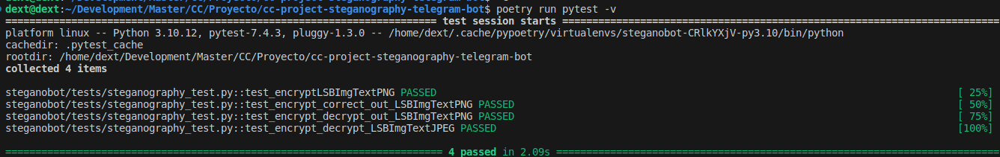

# cc-project-steganography-telegram-bot

**A Python-based Telegram bot to execute steganography technics and analysis from a smartphone.**

---
# Implemented Strategies
[Insert text on images using LSB](docu/LSB-on-images.md)

---
# Application setup
## Python requirements installation

Requirements are managed via [Poetry](https://python-poetry.org/).

You can install Poetry by running ([or follow this guide](https://python-poetry.org/docs/)):
```bash
pip install poetry
```

Then to install the project 
```bash
poetry install
```

## Telegram bot setup

[Summary of the documentation](docu/telegram-bot-quick-guide.md)

## Run the application

To run the application you will need a token from the Telegram BotFather.[(you can follow the documentation here)](docu/telegram-bot-quick-guide.md)

Once you have the access token store create **token.txt** file in the root of the project and store the token inside it.
Also you can run the following commands:
```bash
echo "YOUR_TOKEN" > token.txt
```

Then to run the bot you need to run the following commands:
```bash
export TELEGRAM_BOT_TOKEN=$( cat token.txt )
poetry run steganobot
```

## How to run tests

```bash
poetry run pytest -v
```
## Generate source documentation

The source documentation is generated with [PyDoc](https://docs.python.org/es/3/library/pydoc.html).

**🚧 TO_DO how to run to generate documentation automatically🚧**

## How to use the bot?

You can find a [🚧 manual under construction 🚧 here](docu/how_to_use_the_bot.md).

---
# CC Milestones

## Milestone 0. Problem description, git and GitHub setup

You can find all documentation related to this milestone [here](milestone-docu/0-milestone/).

- [The problem proposal](milestone-docu/0-milestone/problem-description.md)
- [Git and GitHub setup](milestone-docu/0-milestone/git-github-setup.md)
- [Development environment](milestone-docu/0-milestone/setup-environment.md)

## Milestone 1. Specifying and planning the project

You can find all documentation related to this milestone [here](milestone-docu/1-milestone/).
- [User Story definition](https://github.com/dext0s/cc-project-steganography-telegram-bot/issues)
- [Milestones](https://github.com/dext0s/cc-project-steganography-telegram-bot/milestones)
- [User Definition](milestone-docu/1-milestone/user-definition.md)
- [Source class definition](milestone-docu/1-milestone/class-definition.md)

## Milestone 2. Tests

In this milestone we had to decide the strategy for testing the application. You can find a detailed run thorugh the decision [**here**](milestone-docu/2-milestone/test-strategy.md).

In a nutshell:

- For the task runner I'm using [Poetry](https://python-poetry.org/) as it properly manages [PEP-518](https://peps.python.org/pep-0518) for Python dependencies.
- As an assertion library I'm using the standard assertion library from python.
- I wanted to use TDD but Ii have issues generating the test cases before the implementation. Also I'm doing Unit tests with [Pytest](https://pypi.org/project/pytest/).

- Progress on the application:
  -  [M1 - The bot is alive! ](https://github.com/dext0s/cc-project-steganography-telegram-bot/milestone/1) is done. How to register your own bot in Telegram is documented [here](docu/telegram-bot-quick-guide.md).
  -  [M2 - Encrypt into an image](https://github.com/dext0s/cc-project-steganography-telegram-bot/milestone/2) and [M3 - Decrypt an image](https://github.com/dext0s/cc-project-steganography-telegram-bot/milestone/3) 50% done as we still lack the encryption and decryption of two images togeter detailed in [US1](https://github.com/dext0s/cc-project-steganography-telegram-bot/issues/1) and [US3](https://github.com/dext0s/cc-project-steganography-telegram-bot/issues/3).
  