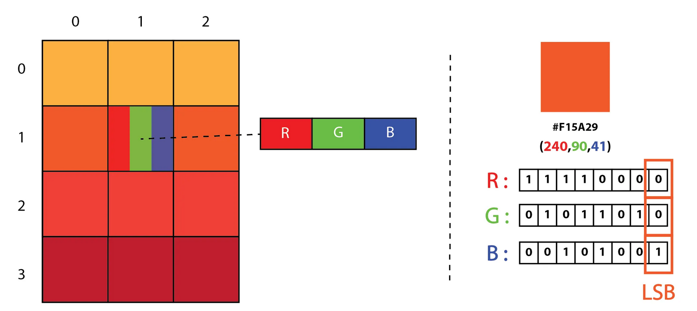

# LSB on images 

This explanation is based on [this article](https://medium.com/swlh/lsb-image-steganography-using-python-2bbbee2c69a2).

This document doesn't pretend to be a through explanation on Least Significant Bit (LSB) steganography method. Just some notes to grasp the concept.

## LSB IMAGE STEGANOGRAPHY

> LSB Steganography is an image steganography technique in which messages are hidden inside an image by replacing each pixel’s least significant bit with the bits of the message to be hidden.

During the project we will use 2 kinds of it:

1. Text encoding: Use the LSB to encode ours ASCII chars
2. Image encoding: Use one of the layers to hide a black & white image. (for instance a QR code).