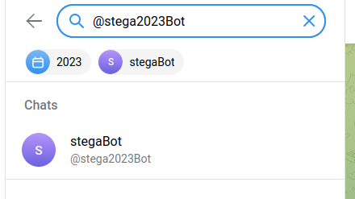
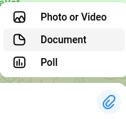
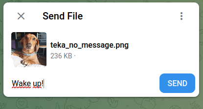
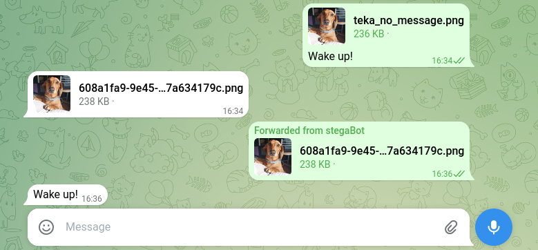

# Manual on how to use SteganoBot
🚧 Manual under construcion , many interactions and fetures may change🚧

## Stablish a conversation with the bot

1. Search your bot on telegram by the name you have given it on the BotFather. In my case **@stega2023Bot**.

2. Open a convsersation with it.

## Encrypt a text message on an image.

1. Select 'Send document' and choose your image to send.

2. Add a caption with the message to encrypt.

3. You will receive an image in return with the message in it.

## Decrypt a text message from an image.

1. Select 'Send document' and choose your image to send.
2. Add no caption.
3. You will receive the message inside the image or a "No hidden message" response. 

   