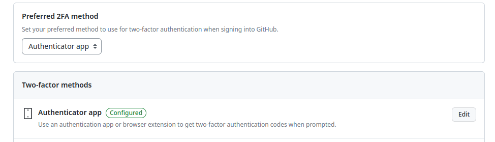
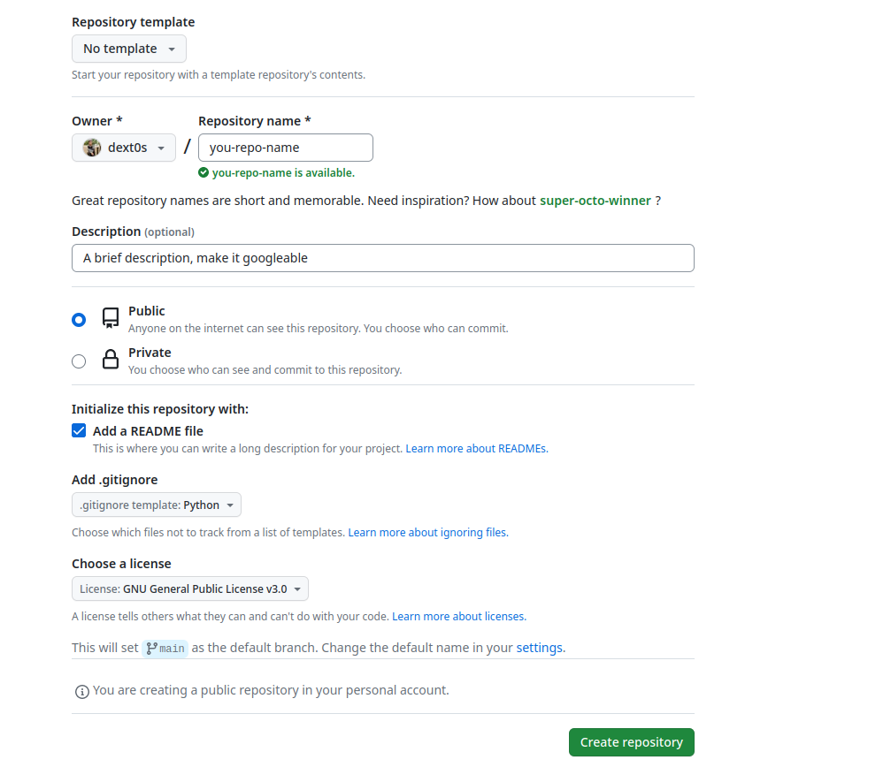
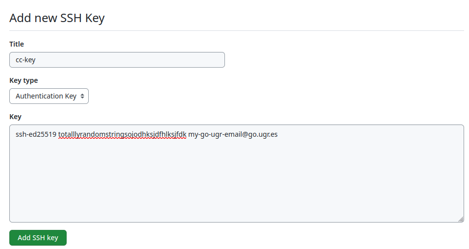
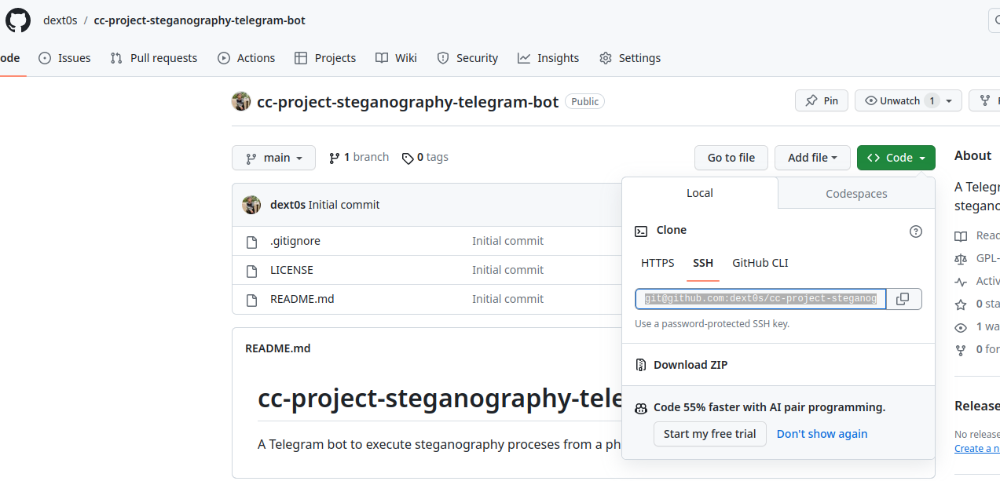

# Creating a GitHub repository and configuring git

## Table of content
<!-- TOC -->
- [Creating a GitHub repository and configuring git](#creating-a-github-repository-and-configuring-git)
  - [Table of content](#table-of-content)
  - [Configure GitHub Account](#configure-github-account)
  - [(Optional) Configure UGR email on GitHub](#optional-configure-ugr-email-on-github)
  - [Setup GitHub Second Factor Authentication (2FA)](#setup-github-second-factor-authentication-2fa)
  - [Creating a GitHub repository](#creating-a-github-repository)
  - [Generate SSH keys to connect to GitHub](#generate-ssh-keys-to-connect-to-github)
  - [Adding SSH public key to GitHub](#adding-ssh-public-key-to-github)
  - [Configure git user and email](#configure-git-user-and-email)
  - [Clone the repository on your local computer](#clone-the-repository-on-your-local-computer)

<!-- /TOC -->

## Configure GitHub Account

In this document it is expected for the user to have an already created GitHub account. If you don't please procede to create one doing the [Sign Up process](https://github.com/signup).

Once you have an account it is required by the [course documentation](https://github.com/cvillalonga/CC-23-24/blob/master/hitos/0.Repositorio.md#en-cuanto-al-entorno) to add a photo, full name, city and university. You can do it if you navigate to the [profile setting](https://github.com/settings/profile).
There you have the fields to add this information as shown in the following image.


This step is done! Congratulations 😊!

## (Optional) Configure UGR email on GitHub
This step is optional and only if you want to sign your commits with your UGR email account and you are using your personal GitHub account.

To add the email you have to go to to the [emails settings](https://github.com/settings/emails) and add your UGR email.

You will have to confirm this email, check your mailbox and follow the confirmation link you have been sent.

Done! Now your UGR mail is set.

## Setup GitHub Second Factor Authentication (2FA)

We are also required to set up an 2FA. 

A Second Factor Authentication(2FA) is a security measure that forces the usage of an auxiliar method of autentication so to ensure you are the owner of the account you are trying to log in.

There are multiple ways to to do this 2FA. You can use either an email or an SMS or an application like Google Authenticator or Authy.

To do so you have to navigate to [ Password and authentication ](https://github.com/settings/security) menu. From there I cannot recreate the steps myself as I have already configured it but you can follow this tutorial for [Authy](https://authy.com/guides/github/) (this is the one I use).

After the tutorial you should have this status on the security menu:


Done! Let's continue with the following step!

## Creating a GitHub repository

Now we are set to create the GitHub repsitory!
We are going to create the repository from the web client going to [create new repository](https://github.com/new).

From here we do the following:
- We make ourselfs as the owners and add a repository name.
- Add a brief description of the repository topic.
- Select the project as public.
- Mark to generate a README file
- (Optional) add a template for the .gitignore if you already know the language you are going to use.
- Choose a licence that suits you.

It should look something like this:


You have you repository, nice!
## Generate SSH keys to connect to GitHub

To be able to commit and push to your repository you have to configure the SSH keys for it.

You should follow the [official documentation from GitHub](https://docs.github.com/es/authentication/connecting-to-github-with-ssh/generating-a-new-ssh-key-and-adding-it-to-the-ssh-agent) for your system, on my case I work in a GNU/Linux environment so I ran:
``` bash
ssh-keygen -t ed25519 -C "my-go-ugr-email@go.ugr.es"
#Output
# > Generating public/private ALGORITHM key pair.
# > Enter passphrase (empty for no passphrase): [Type a passphrase]
# > Enter same passphrase again: [Type passphrase again]
# > Enter a file in which to save the key (/home/YOU/.ssh/ALGORITHM):[Press enter]
#The we have to add the SSH key to the ssh-agent
ssh-add ~/.ssh/name_of_the_key
#Output
# Identity added: ~/.ssh/name_of_the_key (my-go-ugr-email@go.ugr.es)
```
This comands generate a pair of private and public keys.

SSH private key is now added to the ssh-agent. Now we have to add the public key to GitHub, let's check the following step!

## Adding SSH public key to GitHub

Following the the [documentation from GitHub](https://docs.github.com/es/authentication/connecting-to-github-with-ssh/adding-a-new-ssh-key-to-your-github-account?tool=webui) we need to open [new key menu](https://github.com/settings/ssh/new) and add the content of the public key file, on linux we can check the content with this command:
``` bash
cat ~/.ssh/name_of_the_key.pub
# Output example
# ssh-ed25519 totalllyrandomstringsojodhksjdfhlksjfdk my-go-ugr-email@go.ugr.es
```

You need to add the full output of the command:


You key is set! We are almost done!
## Configure git user and email

You have to install git program first, to do so you have to follow [this tutorial](https://github.com/git-guides/install-git).
On Ubuntu you can run the following command:
```bash
sudo apt install git
```

Once the git client installed we have to set the username and email, following [official documentation](https://docs.github.com/en/get-started/getting-started-with-git/setting-your-username-in-git) you have to run:
```bash
### Setting name
git config --global user.name "Your name"
#To confirm
git config --global user.name
# output "Your name"
### Setting email
git config --global user.email "my-go-ugr-email@go.ugr.es"
#To confirm
git config --global user.email 
# output "my-go-ugr-email@go.ugr.es"
```

Now let's test if we have access to GitHub, following [this documentation](https://docs.github.com/en/authentication/connecting-to-github-with-ssh/testing-your-ssh-connection):
```bash
ssh -T git@github.com
#Output 
#Hi USERNAME! You've successfully authenticated, but GitHub does not provide shell access.
```
## Clone the repository on your local computer

This is the last step of this document. Let's clone the repository on our local computer.

To do so we need the link to it, we can get it from the url of the repository.


And on GNU/Linux run:
```bash
git clone git@github.com:dext0s/cc-project-steganography-telegram-bot.git
```

And from here you should be able to commit and push without issue! Enjoy!


